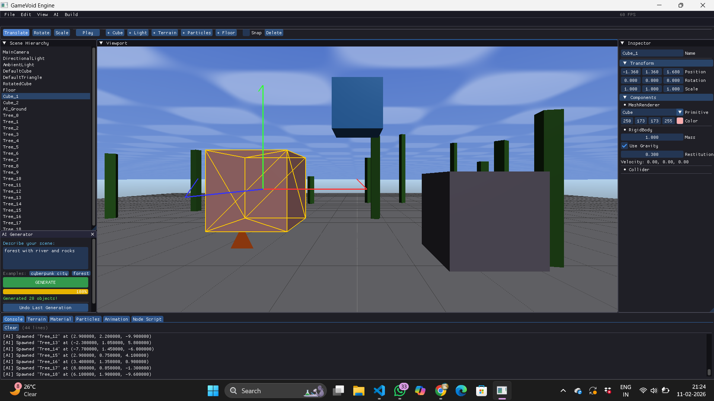

# GameVoid Engine

A modular C++ game engine skeleton designed for 2D/3D game development with AI-assisted content creation.




## Building

```bash
mkdir build && cd build
cmake .. -DCMAKE_BUILD_TYPE=Debug
cmake --build .
```

## Running

```bash
# Launch with CLI editor (default)
./GameVoid

# Launch real-time window (requires OpenGL/GLFW linked)
./GameVoid --no-editor

# With Gemini AI key
./GameVoid --api-key YOUR_GEMINI_API_KEY
```

## CLI Editor Commands

| Command | Description |
|---------|-------------|
| `help` | List all commands |
| `spawn <type> <name>` | Spawn an object (cube, sphere, plane, light, camera, empty) |
| `list` | List all scene objects |
| `inspect <name>` | Show object details and components |
| `setpos <name> x y z` | Set object position |
| `setrot <name> pitch yaw roll` | Set rotation (degrees) |
| `setscale <name> x y z` | Set scale |
| `delete <name>` | Remove an object |
| `physics step [dt]` | Run one physics tick |
| `ai <prompt>` | Send a prompt to Gemini |
| `aigenlevel <desc>` | Generate a level from text |
| `run <script.lua>` | Execute a Lua script |
| `dump` | Print scene hierarchy |
| `exit` | Quit |

## Modules

### Core
- **Math**: Vec2/3/4, Mat4, Quaternion with full operator support
- **Transform**: TRS model matrix, Euler convenience setters
- **Component**: Base class with lifecycle hooks (OnAttach, OnUpdate, OnRender, etc.)
- **GameObject**: Named entity with Transform + Component collection + hierarchy
- **Scene**: Manages a collection of GameObjects with Start/Update/Render lifecycle

### Renderer
- **IRenderer**: Abstract rendering API (OpenGL implementation provided)
- **Camera**: Perspective and orthographic projection as a Component
- **Lighting**: Ambient, Directional, Point, and Spot light components
- **MeshRenderer / SpriteRenderer**: Connect meshes and materials to GameObjects

### Physics
- **RigidBody**: Dynamic/Static/Kinematic body with force/impulse API
- **Collider**: Box, Sphere, Capsule shapes + trigger flag
- **PhysicsWorld**: Fixed-timestep integration, collision detection, raycast

### Assets
- **Texture**: Load images, bind to GPU units
- **Mesh**: Load from file or create primitives (cube, sphere, plane, quad)
- **Material**: PBR-style properties (albedo, metallic, roughness, textures)
- **AssetManager**: Deduplicated cache for all loaded resources

### AI (Google Gemini)
- Send arbitrary prompts to the Gemini API
- Generate Lua scripts from behaviour descriptions
- Generate entire levels from text prompts (returns blueprint objects to spawn)

### Scripting (Lua)
- ScriptComponent attaches to any GameObject
- ScriptEngine manages the Lua state and exposes engine bindings
- Hot-reload placeholder for live editing

### Future-Ready Placeholders
- AnimationSystem (skeletal + keyframe)
- ShaderLibrary (hot-reload)
- PostProcessing (bloom, SSAO, tone-mapping)
- AudioEngine (2D/3D spatial)
- NetworkManager (multiplayer)
- InputManager (keyboard, mouse, gamepad)
- ParticleSystem (GPU emitters)
- UISystem (immediate-mode widgets)

## Dependencies (not bundled)

| Library | Purpose | Link |
|---------|---------|------|
| GLFW | Window/context | https://www.glfw.org |
| GLAD/GLEW | OpenGL loader | https://glad.dav1d.de |
| GLM | Math (optional replacement) | https://github.com/g-truc/glm |
| Assimp | 3D model loading | https://github.com/assimp/assimp |
| stb_image | Texture loading | https://github.com/nothings/stb |
| Lua 5.4 + sol2 | Scripting | https://github.com/ThePhD/sol2 |
| libcurl | HTTP for Gemini API | https://curl.se/libcurl |
| nlohmann/json | JSON parsing | https://github.com/nlohmann/json |

## License

MIT — use freely for any project.
