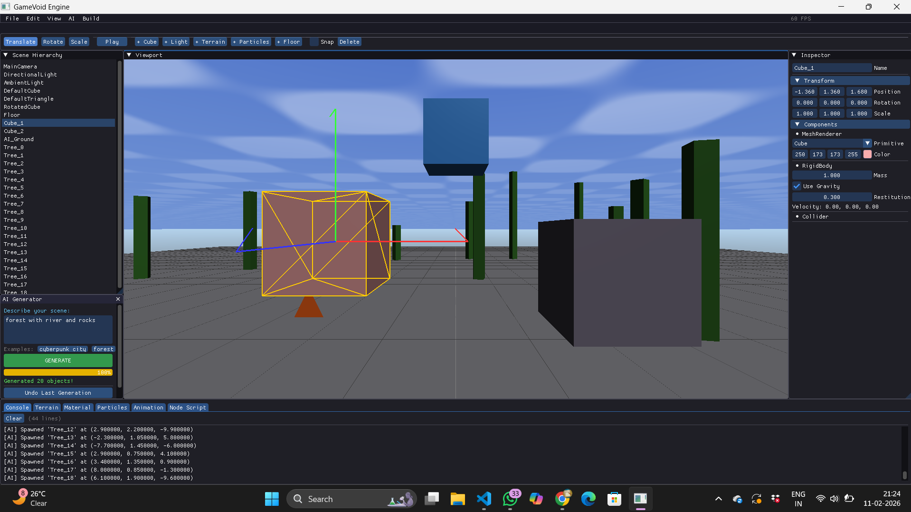

<div align="center">

# GameVoid Engine

### Describe it. Generate it. Play it.

*An AI-powered game engine where you build 2D and 3D games by just telling it what you want.*



</div>

---

## What is GameVoid?

GameVoid is a **vibe-coding game engine** — instead of hand-placing every object and writing every line of code, you describe what you want in plain English and let AI build it for you.

Want a cyberpunk city with neon buildings? Type it. Need a 2D platformer with ground, platforms, and coins? Just ask. GameVoid uses **Google Gemini AI** to turn your ideas into playable scenes in seconds.

It's a full-featured 2D/3D game editor with a Godot-style UI, built from scratch in C++ with OpenGL. Whether you're a beginner who's never touched a game engine or an experienced dev who wants to prototype fast, GameVoid gets you from idea to game with minimal friction.

---

## Why GameVoid?

| Problem | GameVoid's Answer |
|---|---|
| "I have a game idea but can't code" | Describe your scene in English → AI generates it |
| "Setting up a level takes forever" | One-click AI scene generation for both 2D and 3D |
| "Game engines are too complex" | Clean, focused UI — hierarchy, viewport, inspector, done |
| "I want to prototype fast" | Type a prompt, hit Generate, and start playing immediately |
| "I need both 2D and 3D" | Toggle between full 2D and 3D editors with one button |

---

## Key Features

### AI-Powered Scene Generation
The heart of GameVoid. Open the AI panel, type something like:
- *"2D platformer with ground, platforms, and coins"*
- *"space scene with stars, planet, and a spaceship"*
- *"medieval castle with towers"*
- *"forest with river and rocks"*
- *"make 3D shooter map with cover and platforms"*

Hit **Generate** and watch your scene appear. The AI creates game objects with proper transforms, components, materials, and physics — ready to play. Works in both 2D and 3D modes.

### Built-in Gemini Chat
Talk directly to Gemini 3.0 inside the editor. Ask about game design, get help with gameplay logic, brainstorm level ideas — all without leaving the engine. It's like having a game dev mentor built into your tools.

### Full 2D + 3D Editor
A Godot-style editor layout with:
- **Hierarchy Panel** — see and organize all objects in your scene (tree view with drag-and-drop parenting)
- **Viewport** — real-time 3D view with orbit camera, gizmos for translate/rotate/scale (W/E/R keys), grid, wireframe toggle, and a fully separate 2D viewport with pan/zoom
- **Inspector** — edit transforms, tweak components, adjust materials, physics properties, and more
- **Console** — live logs, errors, and AI status messages
- **Bottom Tabs** — dedicated panels for Terrain, Materials, Particles, Animation, and Visual Scripting

### Terrain Editor
Sculpt landscapes directly in the editor — raise, lower, smooth, and flatten terrain with adjustable brush size and strength. Paint textures onto terrain layers. Generate heightmaps from noise or import your own.

### Particle System
Create fire, smoke, sparks, rain — any particle effect you can imagine. Tweak emission rate, lifetime, velocity, color gradients, and size curves all from the editor panel.

### Material Editor
PBR materials with albedo, metallic, roughness, normal maps, and emissive properties. Visual node graph support for advanced material creation.

### Animation System
Keyframe and skeletal animation support. Create, edit, and preview animation clips right inside the editor with timeline controls.

### Visual Node Scripting
Wire up game logic without writing code using the node graph editor. Connect nodes for events, conditions, and actions to build behaviors visually.

### Scene Save/Load & Export
Save and load entire scenes (`.gvs` format). Export scenes for sharing. Full undo/redo support (Ctrl+Z / Ctrl+Y) so you never lose work.

### Drag-and-Drop Asset Import
Drag files from your OS file explorer directly into the editor — 3D models (OBJ, FBX, glTF, STL, PLY, DAE), textures (PNG, JPG, BMP, TGA), and audio (WAV, MP3, OGG) are all supported.

### Physics
Rigid bodies (dynamic, static, kinematic), box/sphere/capsule colliders, triggers, gravity, force/impulse API, collision detection, and raycasting — all configurable from the inspector.

### Lua Scripting
Attach scripts to any game object. The built-in Lua engine exposes the full GameVoid API so you can add custom gameplay logic, AI behaviors, and interactive elements.

---

## Quick Start

### Build

```bash
mkdir build && cd build
cmake .. -DCMAKE_BUILD_TYPE=Debug
cmake --build .
```

### Run

```bash
# Launch the graphical editor (recommended)
./GameVoid --editor-gui

# Launch the CLI editor
./GameVoid

# Run without editor (real-time loop only)
./GameVoid --no-editor

# Set your Gemini AI API key
./GameVoid --editor-gui --api-key YOUR_GEMINI_API_KEY
```

You can also configure your API key from inside the editor via the **AI** menu.

### Command-Line Options

| Flag | Description |
|------|-------------|
| `--editor-gui` / `--gui` | Launch the graphical Dear ImGui editor |
| `--no-editor` | Skip editors, run the real-time game loop |
| `--api-key <KEY>` | Set your Google Gemini API key |
| `--width <W>` | Window width (default: 1280) |
| `--height <H>` | Window height (default: 720) |
| `--help` / `-h` | Show help |

---

## Editor Shortcuts

| Shortcut | Action |
|----------|--------|
| `W` | Translate gizmo |
| `E` | Rotate gizmo |
| `R` | Scale gizmo |
| `Z` | Toggle wireframe |
| `Home` | Jump camera to center |
| `Delete` | Delete selected object |
| `Ctrl+Z` | Undo |
| `Ctrl+Y` | Redo |
| `Ctrl+C` | Copy |
| `Ctrl+V` | Paste |
| `Ctrl+D` | Duplicate |
| `Ctrl+A` | Select all |
| `Ctrl+I` | Import asset |

---

## Project Structure

```
gamevoid/
├── src/            # Engine source code
│   ├── main.cpp    # Entry point
│   ├── core/       # Engine, window, scene management
│   ├── editor/     # Dear ImGui graphical editor
│   ├── editor2d/   # 2D-specific editor & viewport
│   ├── ai/         # Gemini AI integration
│   ├── renderer/   # OpenGL renderer
│   ├── physics/    # Physics world & collision
│   ├── scripting/  # Lua engine & visual node graph
│   ├── assets/     # Asset loading & caching
│   ├── terrain/    # Terrain generation & editing
│   ├── effects/    # Particle system
│   └── animation/  # Skeletal & keyframe animation
├── include/        # Header files (mirrors src/ structure)
├── deps/           # Third-party dependencies
└── build/          # Build output
```

---

## Dependencies

| Library | What it does |
|---------|-------------|
| [GLFW](https://www.glfw.org) | Window & input |
| [Dear ImGui](https://github.com/ocornut/imgui) | Editor UI |
| [stb_image](https://github.com/nothings/stb) | Texture loading |
| [miniaudio](https://miniaud.io) | Audio playback |
| [libcurl](https://curl.se/libcurl) | HTTP requests for Gemini API |
| [nlohmann/json](https://github.com/nlohmann/json) | JSON parsing |

---

## Roadmap

- [ ] Multiplayer / networking support
- [ ] Post-processing effects (bloom, SSAO, tone mapping)
- [ ] Shader hot-reload
- [ ] Full audio engine with 3D spatial sound
- [ ] Game export / standalone builds
- [ ] Plugin system

---

<div align="center">

**Built with vibes. Powered by AI.**

</div>
